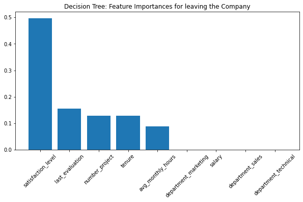
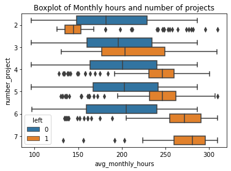
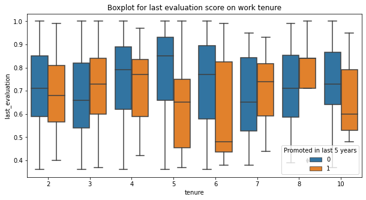

# Machine Learning Capstone Project  
# Overview
My project focuses on addressing the high employee turnover rate by leveraging self-reported data from employees across 10 different fields within a global vehicle manufacturing company. Through data analysis and machine learning techniques, I have uncovered key factors that contribute to an employee's decision to leave the organization.

During my capstone project, I am applying the skills and knowledge I gained from each of the courses and their respective end-of-course projects. The capstone project scenario provides me with opportunities to:

- Collect information related to a business dilemma or organizational question.
- Tackle questions using Python programming.
- Perform exploratory data analysis.
- Develop statistical and machine learning models.
- Address ethical considerations pertinent to the project.
- Present my conclusions to a broad stakeholder audience.

  # Data Dictionary

The dataset, named `HR_capstone_dataset.csv`, encompasses the following:

- 14,999 rows, each representing different pieces of self-reported information from individual employees.
- 10 columns, detailed as follows:

| Column name            | Type  | Description                                             |
| ---------------------- | ----- | ------------------------------------------------------- |
| satisfaction_level     | int64 | Self-reported satisfaction level [0-1]                  |
| last_evaluation        | int64 | Score from the employee's last performance review [0–1] |
| number_project         | int64 | Number of projects contributed to                       |
| average_monthly_hours  | int64 | Average hours worked per month                          |
| time_spend_company     | int64 | Years with the company                                  |
| work_accident          | int64 | Incidence of work-related accidents                    |
| left                   | int64 | Whether the employee left the company                   |
| promotion_last_5years  | int64 | Promotions received in the last 5 years                 |
| department             | str   | Department of employment                                |
| salary                 | str   | Salary bracket (low, medium, high)                      |

# Key Insights

- The decision tree visualization indicates that features such as 'satisfaction_level', 'number_project', 'last_evaluation', and 'tenure' significantly influence decision-making processes within the model.

   
- The data points to poor management within the company, evidenced by a significant imbalance in working hours, leading to some employees being underutilized while others are overworked.

  
- The promotional practices appear flawed; employees with lower evaluation scores have been promoted, whereas those with higher scores have not.

   

# Model Development and Evaluation
A logistic regression model and tree-based models are suitable for this task because it involves predicting a classification label. Four models were built in this project.

# Train-Test Split

To develop and evaluate the machine learning models, the dataset was divided into two parts:

- **Training and Validation Set (75%)**: This subset contains 75% of the data, which is used for training the models and performing techniques such as cross-validation to tune the hyperparameters and prevent overfitting. An evaluation score would be computed for each model using the validation dataset, which is 25% of this subset.

- **Test Set (25%)**: The remaining 25% of the data serves as the unseen test set. This part is used to evaluate the final performance of the champion model, providing an estimate of how well the champion model is expected to perform on new, unseen data.

The train-test split ensures that the models are being tested on data that has not been used during the training process, which is crucial for assessing the model's ability to generalize.

# Evaluation Scores:

| model_name                | accuracy | precision | recall  | auc     | f1     |
| ------------------------- | -------- | --------- | ------- | ------- | ------ |
| Tuned Decision Tree model | 0.979983 | 0.961022  | 0.916964| 0.971640| 0.938387|
| Tuned Random Forest       | 0.975979 | 0.979157  | 0.874107| 0.980053| 0.923494|
| Tuned XGBoost model       | 0.981168 | 0.973369  | 0.911607| 0.985647| 0.941435|
| Logistic Regression model | 0.788350 | 0.331148  | 0.270777| 0.581018| 0.297935|

Tree-based models have consistently outperformed the logistic regression model, likely because they can capture and model complex interactions between features that linear models cannot.

The Champion Model, which is the XGBoost, yields the following scores on the remaining unseen test data:

| model_name                | accuracy | precision | recall  | auc     | f1     |
| ------------------------- | -------- | --------- | ------- | ------- | ------ |
| Champion Model (XGBoost)  | 0.981168 | 0.973369  | 0.911607| 0.985647| 0.941435|

